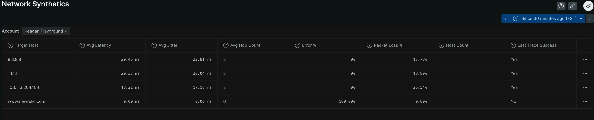
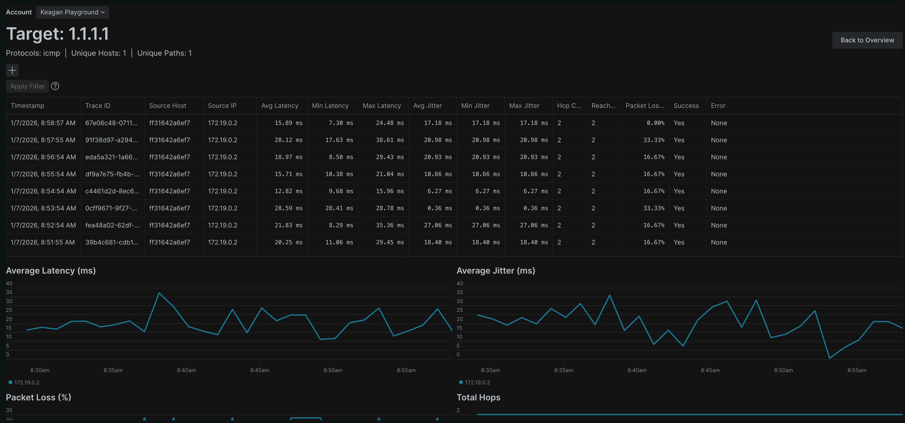
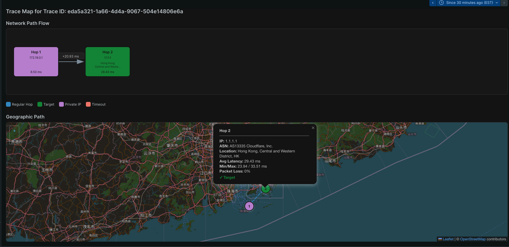

<a href="https://opensource.newrelic.com/oss-category/#community-plus"><picture><source media="(prefers-color-scheme: dark)" srcset="https://github.com/newrelic/opensource-website/raw/main/src/images/categories/dark/Community_Plus.png"><source media="(prefers-color-scheme: light)" srcset="https://github.com/newrelic/opensource-website/raw/main/src/images/categories/Community_Plus.png"></picture></a>


# Network Synthetics

Visualize data reported via nri-net-path OHI.

## Features
- Table views of useful information (latency, jitter, packet loss) for each target being traced
- Per hop breakdown of latency, jitter, packet loss
- Hop maps (static and geographic)
- Filtering of traces and hops based on tags or other metadata

## Dependencies

- [nri-net-path OHI](https://github.com/newrelic/nri-net-path) installed & configured.


## Screenshots




## <a id="enable"></a>Deploying this App

To deploy this app:

Open a command prompt in the nerdpack's directory and run the following commands.

```bash
# To create a new uuid for the nerdpack so that you can deploy it to your account:
# nr1 nerdpack:uuid -g [--profile=your_profile_name]

# To see a list of API keys / profiles available in your development environment:
# nr1 profiles:list

nr1 nerdpack:publish [--profile=your_profile_name]
nr1 nerdpack:subscribe [-c [DEV|BETA|STABLE]] [--profile=your_profile_name]
```

Visit [https://one.newrelic.com](https://one.newrelic.com), navigate to the Nerdpack, and :sparkles:


#### App Customization
If you need to customize the app, fork the codebase and follow the instructions on how to [Customize a Nerdpack](https://docs.newrelic.com/docs/new-relic-solutions/tutorials/customize-nerdpacks/). If you have a change you feel everyone can benefit from, please submit a PR!

## Support

<a href="https://github.com/newrelic?q=nrlabs-viz&amp;type=all&amp;language=&amp;sort="></a>

This project is actively maintained by the New Relic Labs team. Connect with us directly by [creating issues](../../issues) or [asking questions in the discussions section](../../discussions) of this repo.

We also encourage you to bring your experiences and questions to the [Explorers Hub](https://discuss.newrelic.com) where our community members collaborate on solutions and new ideas.

New Relic has open-sourced this project, which is provided AS-IS WITHOUT WARRANTY OR DEDICATED SUPPORT.

## Security

As noted in our [security policy](https://github.com/newrelic/nr-labs-pages/security/policy), New Relic is committed to the privacy and security of our customers and their data. We believe that providing coordinated disclosure by security researchers and engaging with the security community are important means to achieve our security goals.

If you believe you have found a security vulnerability in this project or any of New Relic's products or websites, we welcome and greatly appreciate you reporting it to New Relic through [HackerOne](https://hackerone.com/newrelic).

## Contributing

Contributions are welcome (and if you submit a Enhancement Request, expect to be invited to contribute it yourself :grin:). Please review our [Contributors Guide](CONTRIBUTING.md).

Keep in mind that when you submit your pull request, you'll need to sign the CLA via the click-through using CLA-Assistant. If you'd like to execute our corporate CLA, or if you have any questions, please drop us an email at opensource@newrelic.com.

## Open Source License

This project is distributed under the [Apache 2 license](LICENSE).
